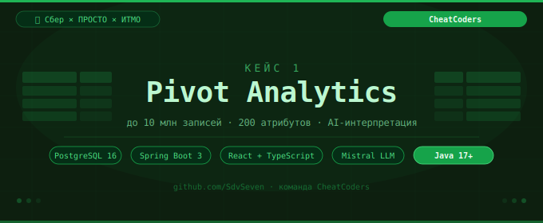

<div align="center">
  
</div>

<div align="center">

[](https://sber.ru)
[](https://openjdk.org)
[](https://spring.io)
[](https://react.dev)
[](https://postgresql.org)

</div>

---

## 📋 Содержание

- [О проекте](#-о-проекте)
- [Возможности](#-возможности)
- [Стек технологий](#-стек-технологий)
- [Архитектура](#-архитектура)
- [Запуск проекта](#-запуск-проекта)
- [Команда](#-команда)

---

## 💡 О проекте

Веб-приложение для бизнес-аналитиков, позволяющее создавать сводные таблицы на больших объёмах данных с использованием AI для рекомендаций и интерпретации.

| Показатель | Значение |
|---|---|
| 📦 Объём данных | до **10 млн записей** |
| 📊 Атрибуты | до **200 столбцов** |
| 🤖 AI-модуль | Mistral LLM |
| 🏆 Контекст | Хакатон Сбер × ПРОСТО × ИТМО |

---

## ✨ Возможности

| | Функция |
|---|---|
| 🟢 | Построение pivot-таблиц на больших данных |
| 🟢 | Работа с высоконагруженными наборами данных |
| 🟢 | AI-подсказки для анализа и интерпретации |
| 🟢 | Масштабируемая архитектура |
| 🟢 | Разделение backend / AI / frontend |

---

## 🛠 Стек технологий

```
┌──────────────────────────────────────────────────┐
│              CheatCoders Stack                   │
├─────────────────┬────────────────────────────────┤
│  Frontend       │  React + TypeScript             │
│  Backend        │  Java 17+, Spring Boot 3        │
│  AI-модуль      │  Spring Boot proxy + Mistral    │
│  База данных    │  PostgreSQL 16                  │
└─────────────────┴────────────────────────────────┘
```

---

## 🏗 Архитектура

```
┌─────────────────────────────────────┐
│     Frontend (React + TypeScript)   │
│           localhost:5173            │
└────────────────┬────────────────────┘
                 │ HTTP
┌────────────────▼────────────────────┐
│    Backend API (Spring Boot)        │
│           localhost:8080            │
└──────────┬──────────────┬───────────┘
           │              │
┌──────────▼──────┐  ┌────▼──────────────────┐
│   PostgreSQL 16 │  │  AI Proxy (Spring Boot)│
│  pivot_analytics│  │    localhost:8082       │
└─────────────────┘  └────────────┬───────────┘
                                  │
                         ┌────────▼────────┐
                         │   Mistral LLM   │
                         └─────────────────┘
```

---

## 🚀 Запуск проекта

### 1. База данных (PostgreSQL)

**Установка:**
```bash
brew install postgresql@16
brew services start postgresql@16
```

**Создание базы:**
```bash
createdb pivot_analytics
```

**Инициализация схемы:**
```bash
psql -U <your_user> -d pivot_analytics -f db_scripts/01_create_tables.sql
psql -U <your_user> -d pivot_analytics -f db_scripts/02_create_indexes.sql
```

**Заполнение тестовыми данными:**
```bash
psql -U <your_user> -d pivot_analytics -f db_scripts/03_generate_data.sql
```

---

### 2. Backend (Spring Boot)

```bash
cd back/pivot-demo
mvn spring-boot:run
```

> Сервис доступен на `http://localhost:8080`

---

### 3. AI-модуль (LLM proxy)

```bash
cd back/ml/Danil-Backend/java-backend
export MISTRAL_API_KEY="ваш_ключ"
export MISTRAL_MODEL="mistral-tiny"
mvn spring-boot:run
```

> Сервис доступен на `http://localhost:8082`

---

### 4. Frontend

```bash
cd front
npm install
npm run dev
```

> Приложение доступно на `http://localhost:5173`

---

## 👥 Команда

**CheatCoders** — собраны для хакатона Сбер × ПРОСТО × ИТМО

| Роль | Участник |
|---|---|
| 👑 Капитан, LLM + Backend | [@SdvSeven](https://t.me/SdvSeven) |
| ⚙️ Backend + Data | [@skyperfect](https://t.me/skyperfect) |
| 🎨 Frontend | [@ORLIK1121](https://t.me/ORLIK1121) |
| 📐 Math | [@Stefek2435](https://t.me/Stefek2435) |

---

<div align="center">

**CheatCoders** · Хакатон Сбер × ПРОСТО × ИТМО · MIT License

</div>
